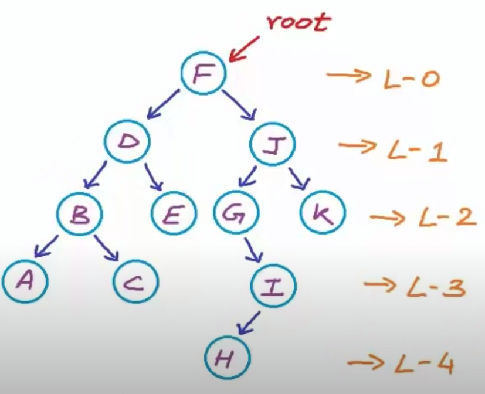

Tree Traversal represents the way that the tree is read.

There are two strategies:

- Breadth-first, also called "Level-Order": In this strategy the tree will be sliced in levels (root is zero) and from that it will be read considering the immediate children of a node and ignoring their grandchild until it goes to the next level.

    From the image above, the nodes would be read as: `[F, D, J, B, E, G, K, A, C, I, H]`.

- Depth First: the depth strategy will consider all subtrees depthness inside of the structure. So, it means that from the given node, it'll consider the right and left subtrees. This approach may be considered in three perspectives:

    - **Preorder**: Considers root (data), then left and right. This may also be called as Data-Left-Right (DLR). The given tree on the image would be read as: `[F, D, B, A, C, E, J, G, I, H, K]`.

    - **InOrder**: Considers left, root (data) and right. This may also be called as Left-Data-Right (LDR). The given tree on the image would be read as: `[A, B, C, D, E, F, G, H, I, J, K]`.

    - **PosOrder**: Considers left, right and then root (data). This may also be called as Left-Right-Data (LRD). The given tree on the image would be read as `[A, C, B, E, D, H, I, G, K, J, F]`. 