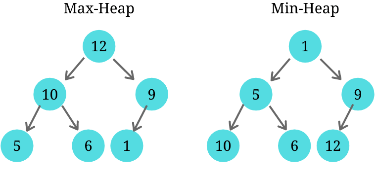
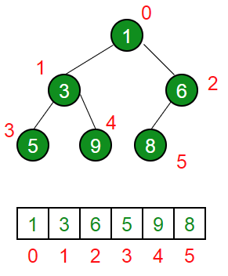

# Heap

A heap is a data structure based on an almost complete tree that must satisfy a heap property. If P is a parent node of C then P key is bigger, equal or lower than the key of C. The criterion for that is defined by the strategy applied (min heap or max heap).

In case of a **min heap**, `PK <= CK` to `PK` be over `CK`. Otherwise those nodes are swapped in order to keep the lowest always on top. For the **max heap** it's the same, but the target is to have the maximum value on top always.

A heap structure can be programatically represented as an array where the nesting levels are defined by indexes.

For a given index `i` you have:

| Position | Expression (Index to fetch) |
| -------- | --------------------------- |
| Left     | `i * 2`                     |
| Right    | `i * 2 + 1`                 |
| Parent   | `i / 2`                     |

> Note: Just to make math easier, we may keep position 0 of the array as null.

